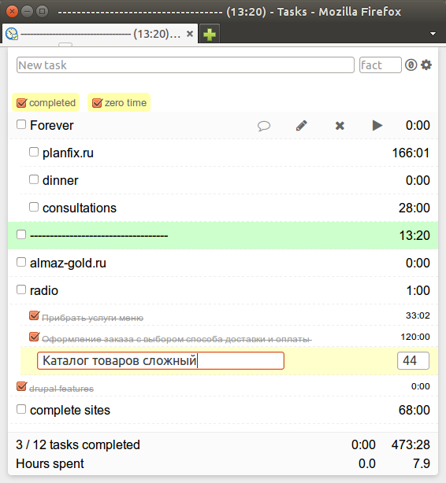

# time_tracker
Backbone & Jquery UI app, hierarchical task timer.

Only russian language!

Demo: http://time.viasite.ru/

## Features
 - fast add tasks
 - record time spent by task
 - desktop notifications
 - hierarchical drag-n-drop interface
 - no server-side, data stored in html storage in browser
 - import-export tasklist to json
 - filters by task status
 - tasklist summary
 - easy to select tasks and copy-paste to plaintext
 
## Keys
 - Del - delete task(s)
 - Click with Ctrl - select some tasks
 - Enter in new task input - add task to selected task
 - Ctrl+Enter in new task input - add task to the end of list
 - Up/Down works on flat task lists

